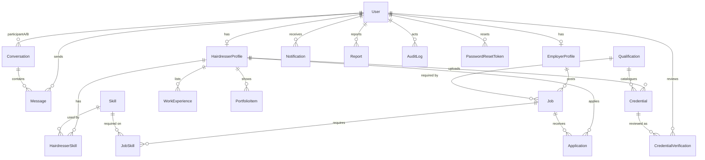

# MM Connect — database map

This file is a snapshot of the **live PostgreSQL database** used by the MVP.

- Source of truth for structure: `database/prisma/schema.prisma`
- Migration: `database/prisma/migrations/20260816000000_init/migration.sql`
- Snapshot taken: 16 August 2026
- Password hashes are **not** included

Current row counts:

| Table | Rows |
| --- | ---: |
| User | 18 |
| HairdresserProfile | 12 |
| EmployerProfile | 5 |
| Skill | 12 |
| HairdresserSkill | 43 |
| Qualification | 4 |
| Credential | 12 |
| CredentialVerification | 10 |
| WorkExperience | 10 |
| PortfolioItem | 10 |
| Job | 8 |
| JobSkill | 8 |
| Application | 4 |
| Conversation | 1 |
| Message | 2 |
| Notification | 5 |
| Report | 1 |
| AuditLog | 3 |
| PasswordResetToken | 0 |

---

## 1. Internal connections (foreign keys)

```
User 1 ──────── 1 HairdresserProfile
User 1 ──────── 1 EmployerProfile

HairdresserProfile * ── HairdresserSkill ── * Skill
HairdresserProfile 1 ── * Credential * ── 0..1 Qualification
HairdresserProfile 1 ── * WorkExperience
HairdresserProfile 1 ── * PortfolioItem
HairdresserProfile 1 ── * Application

EmployerProfile 1 ── * Job
Job * ── JobSkill ── * Skill
Job 0..1 ── Qualification (required qualification)
Job 1 ── * Application

Credential 1 ── * CredentialVerification
User (admin) 1 ── * CredentialVerification

User 1 ── * Conversation (participant A or B)
Conversation 1 ── * Message
User 1 ── * Message (sender)

User 1 ── * Notification
User 1 ── * Report (reporter / reported)
User 1 ── * AuditLog
User 1 ── * PasswordResetToken
```



Foreign keys in the live database:

| From table | Column | To table | To column |
| --- | --- | --- | --- |
| HairdresserProfile | userId | User | id |
| EmployerProfile | userId | User | id |
| HairdresserSkill | hairdresserProfileId | HairdresserProfile | id |
| HairdresserSkill | skillId | Skill | id |
| Credential | hairdresserProfileId | HairdresserProfile | id |
| Credential | qualificationId | Qualification | id |
| CredentialVerification | credentialId | Credential | id |
| CredentialVerification | reviewerId | User | id |
| WorkExperience | hairdresserProfileId | HairdresserProfile | id |
| PortfolioItem | hairdresserProfileId | HairdresserProfile | id |
| Job | employerProfileId | EmployerProfile | id |
| Job | requiredQualificationId | Qualification | id |
| JobSkill | jobId | Job | id |
| JobSkill | skillId | Skill | id |
| Application | jobId | Job | id |
| Application | hairdresserProfileId | HairdresserProfile | id |
| Conversation | participantAId | User | id |
| Conversation | participantBId | User | id |
| Message | conversationId | Conversation | id |
| Message | senderId | User | id |
| Notification | userId | User | id |
| Report | reporterId | User | id |
| Report | reportedUserId | User | id |
| AuditLog | actorId | User | id |
| PasswordResetToken | userId | User | id |

---

## 2. Columns

### User

| Column | Type | Notes |
| --- | --- | --- |
| id | UUID PK | |
| email | text UNIQUE | lowercase |
| passwordHash | text | bcrypt; never returned by API |
| role | enum | HAIRDRESSER / EMPLOYER / ADMIN |
| status | enum | ACTIVE / SUSPENDED |
| createdAt | timestamp | |
| updatedAt | timestamp | |

### HairdresserProfile

| Column | Type | Notes |
| --- | --- | --- |
| id | UUID PK | |
| userId | UUID UNIQUE FK → User | 1:1 |
| firstName, lastName | text | |
| profilePhotoUrl, phone | text? | phone hidden on public profile |
| location, suburb, state, postcode | text? | |
| bio, professionalTitle | text? | |
| yearsOfExperience | int | default 0 |
| employmentStatus | enum? | |
| availability | enum? | |
| preferredEmploymentType | enum? | |
| profileViews | int | |
| createdAt, updatedAt | timestamp | |

### EmployerProfile

| Column | Type | Notes |
| --- | --- | --- |
| id | UUID PK | |
| userId | UUID UNIQUE FK → User | 1:1 |
| businessName | text | |
| logoUrl, description, location, suburb, state | text? | |
| website, phone, contactEmail, businessType | text? | |
| profileViews | int | |
| createdAt, updatedAt | timestamp | |

### Skill / HairdresserSkill

| Skill | Type | HairdresserSkill | Type |
| --- | --- | --- | --- |
| id | UUID PK | id | UUID PK |
| name | text UNIQUE | hairdresserProfileId | FK → HairdresserProfile |
| slug | text UNIQUE | skillId | FK → Skill |
| category | text? | | unique(profile, skill) |
| isActive | boolean | | |

### Qualification / Credential / CredentialVerification

| Credential column | Type | Notes |
| --- | --- | --- |
| id | UUID PK | |
| hairdresserProfileId | FK → HairdresserProfile | |
| qualificationId | FK → Qualification? | catalogue link |
| qualificationName | text | |
| issuingOrganisation | text | |
| credentialNumber, issueDate, expiryDate | optional | |
| documentKey | text? | private file; not public |
| status | enum | PENDING / VERIFIED / REJECTED / EXPIRED |

`CredentialVerification` stores each admin decision: credentialId, reviewerId, status, notes, verifiedAt.

**Only an admin review can set status = VERIFIED.**

### Job / JobSkill / Application

| Job column | Type |
| --- | --- |
| id | UUID PK |
| employerProfileId | FK → EmployerProfile |
| title, description, location | text |
| employmentType | enum |
| salaryMin, salaryMax | int? |
| salaryDisplay | text? |
| requiredExperienceYears | int? |
| requiredQualificationId | FK → Qualification? |
| status | DRAFT / ACTIVE / CLOSED |
| postedAt | timestamp? |

`Application` uniquely pairs `jobId` + `hairdresserProfileId`.

### Conversation / Message

Two users per conversation (`participantAId`, `participantBId`, unique pair).  
`Message` has conversationId, senderId, body, readAt, createdAt.

### Supporting tables

- **Notification:** userId, type, title, body, linkUrl, readAt
- **Report:** reporterId, reportedUserId, targetType, targetId, reason, status
- **AuditLog:** actorId, action, entityType, entityId, metadata
- **PasswordResetToken:** userId, tokenHash, expiresAt, usedAt

---

## 3. Current rows (live snapshot)

Password hashes omitted.

### User

| id | email | role | status |
| --- | --- | --- | --- |
| a783b295-0db8-4345-9c4b-7d225885acf1 | admin@mmcollege.example | ADMIN | ACTIVE |
| b5cfeb4e-7a73-47f9-b5df-7c3351b557f6 | sarah.nguyen@example.com | HAIRDRESSER | ACTIVE |
| 884bd5d4-37c7-4caa-9c7a-0dec7991cbaf | liam.oconnor@example.com | HAIRDRESSER | ACTIVE |
| 2f1681ee-695f-4724-b625-0dc173c76d0d | amelia.rossi@example.com | HAIRDRESSER | ACTIVE |
| 2ecd0b7d-febf-400f-8d74-798de6796cca | noah.patel@example.com | HAIRDRESSER | ACTIVE |
| 52494627-2e81-43da-9f1b-b1eeaa174d30 | priya.singh@example.com | HAIRDRESSER | ACTIVE |
| 903bdd0a-4d05-4961-b77e-3fb620dd7c78 | jordan.lee@example.com | HAIRDRESSER | ACTIVE |
| a5e680df-2e24-4e5d-a908-870145611e7d | elena.martinez@example.com | HAIRDRESSER | ACTIVE |
| 387977c9-02a3-4e15-8f7e-865c3e5c6f36 | marcus.brown@example.com | HAIRDRESSER | ACTIVE |
| 40456d2e-a4c2-429e-ba84-ec72c02e6252 | hana.kim@example.com | HAIRDRESSER | ACTIVE |
| a588ead8-ec64-4618-a1f2-364555e9cd19 | oliver.wright@example.com | HAIRDRESSER | ACTIVE |
| 4dda9df8-ad73-409b-932e-6cb8afb5bcc2 | hello@novasalon.example | EMPLOYER | ACTIVE |
| 2dac2364-1eec-4c18-96c7-ea9eafc02564 | team@harbourandco.example | EMPLOYER | ACTIVE |
| 3b824fe3-163e-4be6-8411-86166f1c3166 | bookings@atelierlane.example | EMPLOYER | ACTIVE |
| 9aac288b-cf8e-4b7f-9fc4-d207f01b5066 | hair.1786847170665@example.com | HAIRDRESSER | ACTIVE |
| ff1f5bbd-33f7-44bd-b187-80b4ecaa1c89 | hair.1786847179122@example.com | HAIRDRESSER | ACTIVE |
| 7b27fe38-9e44-4b1f-a9d8-b8f3facb9b0a | employer.1786847170665@example.com | EMPLOYER | ACTIVE |
| 836ee41b-f7f8-48aa-8c6e-127ed9819fd6 | employer.1786847179122@example.com | EMPLOYER | ACTIVE |

The last four users were created by automated tests.

### HairdresserProfile

| id | userId | Name | Title | Location | Years |
| --- | --- | --- | --- | --- | ---: |
| e5275678-af1a-4638-9d5e-126e80b1e347 | b5cfeb4e-…557f6 | Sarah Nguyen | Qualified Hairdresser | Melbourne, VIC | 6 |
| a3d7b9fe-a065-4781-9bee-bb3346283421 | 884bd5d4-…1cbaf | Liam O'Connor | Senior Barber | Fitzroy, VIC | 8 |
| beed83e6-88ce-4420-b7c4-cc88b09277af | 2f1681ee-…76d0d | Amelia Rossi | Bridal & Event Stylist | South Yarra, VIC | 5 |
| 400486dc-9b85-4ce0-a489-e2c088b5b9f7 | 2ecd0b7d-…96cca | Noah Patel | Colour Technician | Carlton, VIC | 4 |
| 2708e903-e6a2-4d7a-9f2b-4a37548b8846 | 52494627-…74d30 | Priya Singh | Hairdresser | Footscray, VIC | 3 |
| 3983b82d-3e0c-431f-b325-35937a2188db | 903bdd0a-…d7c78 | Jordan Lee | Junior Hairdresser | Geelong, VIC | 1 |
| 97fbbb3b-6568-4a76-9803-995f758bfd99 | a5e680df-…611e7d | Elena Martinez | Senior Stylist | Brighton, VIC | 10 |
| c930c043-c310-4c63-9c4c-97ff9ecfcc53 | 387977c9-…c6f36 | Marcus Brown | Barber & Stylist | Collingwood, VIC | 7 |
| 7967453e-04f7-40a7-a9ca-3c9d8d1d91b6 | 40456d2e-…e6252 | Hana Kim | Creative Colourist | Richmond, VIC | 5 |
| 2e77ce2a-242e-4cf8-a06b-4520dfab6b59 | a588ead8-…9cd19 | Oliver Wright | Salon Hairdresser | Ballarat, VIC | 2 |
| 1877f787-d6fa-47be-b6fe-4c6f99e7cb28 | 9aac288b-…b5066 | Test Stylist | Qualified Hairdresser | Melbourne, VIC | 3 |
| 7449f26d-350b-4b1d-83b4-15ce5b65e7ea | ff1f5bbd-…a1c89 | Test Stylist | Qualified Hairdresser | Melbourne, VIC | 3 |

**Connection example:** `User.b5cfeb4e…` (sarah.nguyen@example.com) → `HairdresserProfile.e5275678…` (Sarah Nguyen).

### EmployerProfile

| id | userId | Business | Location | Type |
| --- | --- | --- | --- | --- |
| 048345c6-cd27-4f71-825d-9ef0e728cf32 | 4dda9df8-…5bcc2 | Nova Salon | Melbourne, VIC | Salon |
| 15c2d7d9-fdff-4a7b-8a56-d5eed3c42fa8 | 2dac2364-…f02564 | Harbour & Co | Fitzroy, VIC | Barber / Salon |
| a888ba8a-d1c6-4a71-8499-eb4569163941 | 3b824fe3-…c3166 | Atelier Lane | South Yarra, VIC | Bridal studio |
| 3bc2e43d-ac2d-4b1e-a61d-96d15ced3047 | 7b27fe38-…9b0a | Test Salon | | |
| 188f68e7-7c12-4bcf-aa7e-08fd423be3b3 | 836ee41b-…19fd6 | Test Salon | | |

**Connection example:** `User.4dda9df8…` (hello@novasalon.example) → `EmployerProfile.048345c6…` (Nova Salon) → jobs `be58facd…`, `adfd3b19…`, `c51f9a09…`.

### Skill

| name | slug |
| --- | --- |
| Balayage | balayage |
| Barbering | barbering |
| Blow drying | blow-drying |
| Bridal styling | bridal-styling |
| Customer service | customer-service |
| Extensions | extensions |
| Foiling | foiling |
| Hair colouring | hair-colouring |
| Hair cutting | hair-cutting |
| Keratin treatments | keratin-treatments |
| Other | other |
| Styling | styling |

`HairdresserSkill` has **43** join rows linking profiles to these skills.

### Qualification

| id | name | level |
| --- | --- | --- |
| 6e7e4ddd-2a4b-4dab-979f-fd412ff79d94 | Certificate III in Hairdressing | Certificate III |
| 7ecc99bc-da44-4485-82f2-3dc2e95d6f42 | Certificate IV in Hairdressing | Certificate IV |
| 072f54c7-5241-4504-ac2d-0da5017f2c18 | Certificate III in Barbering | Certificate III |
| f14bab0e-1b56-4273-bbee-7f41c8106f0a | Diploma of Salon Management | Diploma |

### Credential

| id | hairdresserProfileId | qualificationName | status |
| --- | --- | --- | --- |
| c0597656-a3d1-4153-b6a6-0fdd1b91b446 | e5275678-…e347 (Sarah) | Certificate IV in Hairdressing | VERIFIED |
| b16d005f-a7ed-42c2-be14-b9ebd8249f79 | a3d7b9fe-…3421 (Liam) | Certificate III in Barbering | VERIFIED |
| fd8ef5a1-72cf-44a8-a275-cf458ac74445 | beed83e6-…77af (Amelia) | Certificate III in Hairdressing | VERIFIED |
| 1bf9cb75-2012-45f4-b042-752fc2abc425 | 400486dc-…b9f7 (Noah) | Certificate III in Hairdressing | PENDING |
| f11030c3-588b-4e9e-a104-ac9ad1b31207 | 2708e903-…8846 (Priya) | Certificate IV in Hairdressing | VERIFIED |
| 380b32de-9634-476f-8689-d18331fc9104 | 3983b82d-…188db (Jordan) | Certificate III in Hairdressing | REJECTED |
| 41295737-f105-4d00-b44c-cbacf0735f57 | 97fbbb3b-…bfd99 (Elena) | Certificate III in Hairdressing | VERIFIED |
| c635749d-4b77-4e43-bd98-e1c8e82cf8b9 | c930c043-…fcc53 (Marcus) | Certificate III in Barbering | VERIFIED |
| eb8991fd-cf68-471e-b169-608e7be97c94 | 7967453e-…91b6 (Hana) | Certificate IV in Hairdressing | PENDING |
| e7084284-65ce-4abc-9241-2027d94e7f27 | 2e77ce2a-…6b59 (Oliver) | Certificate III in Hairdressing | VERIFIED |
| b78f97e8-4b79-4a26-b0da-21515763ed37 | 1877f787-…cb28 (Test) | Diploma of Salon Management | VERIFIED |
| 86e2d221-01d6-47da-a649-cfcb6dc8d4e1 | 7449f26d-…e7ea (Test) | Diploma of Salon Management | VERIFIED |

**Connection example:** Sarah’s credential `c0597656…` → Qualification “Certificate IV in Hairdressing” → reviewed by admin `a783b295…` in `CredentialVerification`.

### Job

| id | employer | title | location | status |
| --- | --- | --- | --- | --- |
| be58facd-a1bf-45a9-9b04-a0f0c913e917 | Nova Salon | Qualified Hairdresser — Full time | Melbourne, VIC | ACTIVE |
| adfd3b19-7e26-414e-9cdd-eac034ffc364 | Nova Salon | Senior Colourist | Melbourne, VIC | ACTIVE |
| e7d8657a-401c-4f08-8be3-0b094f960003 | Harbour & Co | Barber — Fitzroy | Fitzroy, VIC | ACTIVE |
| b0f21699-bfde-4d53-bb2a-ce09c167ef7d | Harbour & Co | Part-time Stylist | Fitzroy, VIC | ACTIVE |
| 9532736f-164b-4832-a260-9e86b5444048 | Atelier Lane | Bridal Stylist — Seasonal | South Yarra, VIC | ACTIVE |
| c51f9a09-13d9-43e8-a964-c917388f1151 | Nova Salon | Apprentice Hairdresser (draft) | Melbourne, VIC | DRAFT |
| 128db892-56ce-4ab3-a44d-55851f2290b4 | Test Salon | Test Hairdresser Role | Melbourne, VIC | ACTIVE |
| 29f24290-3ca3-4266-b923-abdb744d4eab | Test Salon | Test Hairdresser Role | Melbourne, VIC | ACTIVE |

### Application

| id | job | hairdresser | status |
| --- | --- | --- | --- |
| 2d037d52-6e90-4c31-918e-2a18499ed921 | Qualified Hairdresser — Full time | Sarah Nguyen | INTERESTED |
| 235d600e-10c6-4ba9-add6-dbf394b0aee6 | Barber — Fitzroy | Liam O'Connor | INTERESTED |
| 4eaa0cc5-dbc5-466f-88d3-71f73e8792c6 | Test Hairdresser Role | Test Stylist | INTERESTED |
| 0f0966ea-51c1-4b42-a4d9-3f6de0790a74 | Test Hairdresser Role | Test Stylist | INTERESTED |

**Connection example:** Sarah (`e5275678…`) applied to Nova Salon’s full-time job (`be58facd…`).

---

## 4. How to inspect it yourself

```bash
# Columns
psql "$DATABASE_URL" -c '\d "User"'

# All foreign keys
psql "$DATABASE_URL" -c "\d+"

# Prisma Studio (visual table browser)
npm run db:studio
```

Prisma Studio opens a local UI where you can click each table, see every column, and follow relation links between rows.
